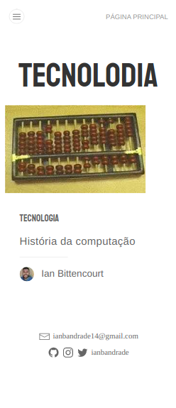

<div align="center">
  
</div>

<p align="center">
  <a href="#layout">Layout</a>
  &nbsp;&nbsp;&nbsp;|&nbsp;&nbsp;&nbsp;
  <a href="#about">About</a>
   &nbsp;&nbsp;&nbsp;|&nbsp;&nbsp;&nbsp;
  <a href="#techs">Techs</a>
  &nbsp;&nbsp;&nbsp;|&nbsp;&nbsp;&nbsp;
  <a href="#run">Run</a>
  &nbsp;&nbsp;&nbsp;|&nbsp;&nbsp;&nbsp;
  <a href="#license">License</a>
</p>

## Layout

<div align="center">
  
    &nbsp;&nbsp;&nbsp;

</div>

## About

The idea came up with the intention of passing on some knowledge about technology and my day to day, from a blog. Thus, this project is a way that I found interesting to make it possible for me to expose some information in a practical and quick way.

## Techs

- GraphQL
- Gatsby
- Strapi (backend integration)

## Run

### Clone the repository

```bash
# Clone Repository
$ git clone https://github.com/ianbandrade/BLOG-Tecnolodia.git
```

### Run web

```bash
# Go to folder
$ cd BLOG-Tecnolodia

# Install Dependencies
$ yarn install

# Run Aplication
$ gatsby develop
```

Go to http://localhost:8000/ to see the result.

## License

This project is under the MIT license. See the file [LICENSE](LICENSE) for more details.
